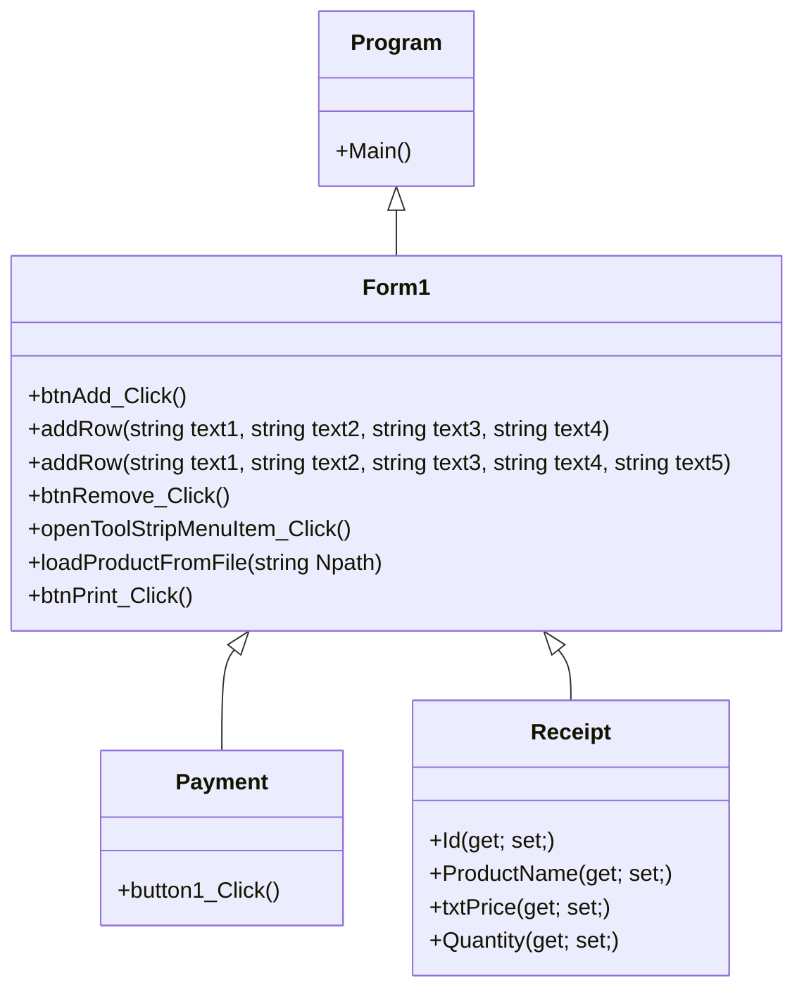

## ร้านขายของ
### ความเป็นมาของโปรแกรม
ที่ทำเพราะว่าซื้อขายอยู่ในชีวิตประจำวัน 
  
### วัตถุประสงค์ของโปรแกรม
พัฒนาขึ้นมาเพื่อใช้ในการศึกษาและเรียนรู้ในการเขียนโปรแกรมและเพื่อการพัฒนาในอนาคต

  
### โครงสร้างของโปรแกรม

  
### ผู้พัฒนาโปรแกรม
ศรสวรรค์ ไพรอนันต์ 643450085-8
